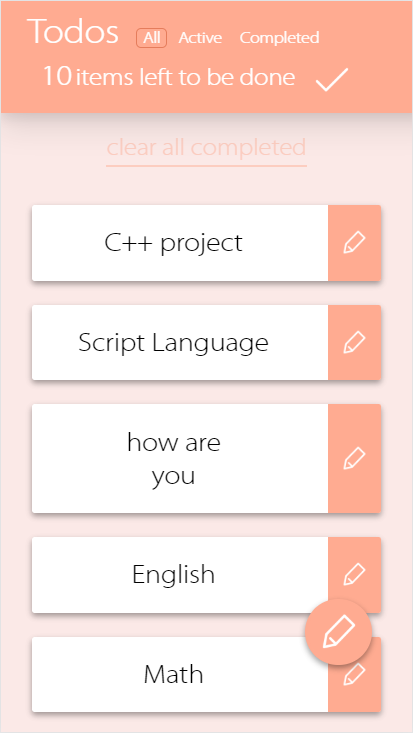
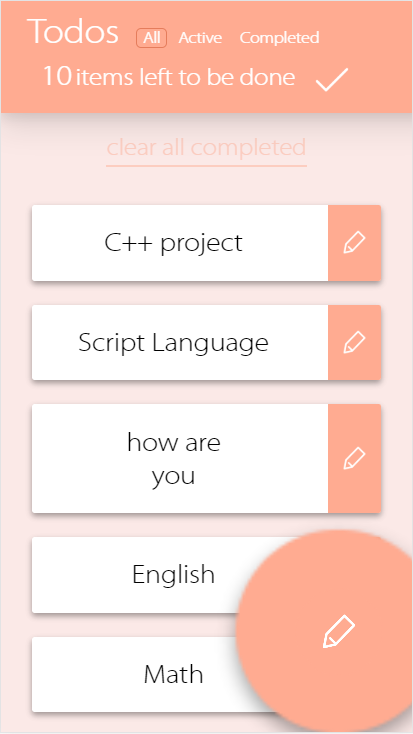
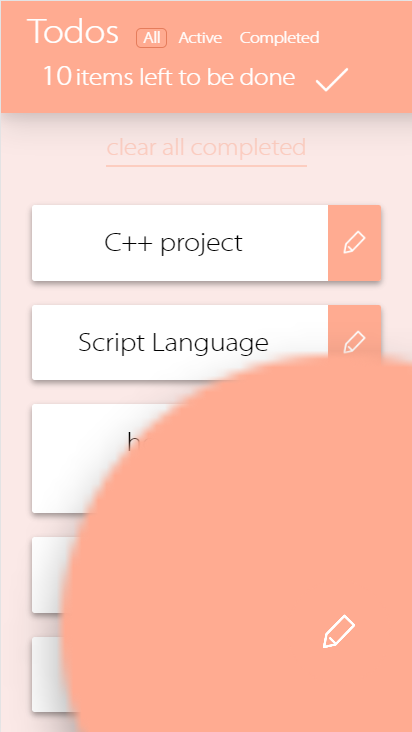
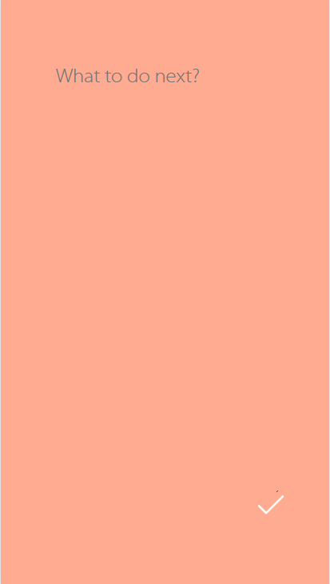
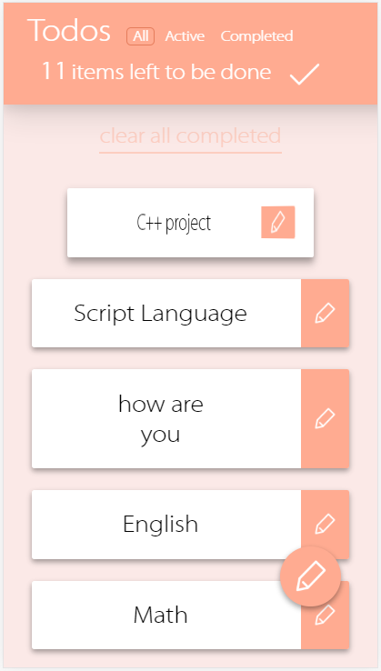
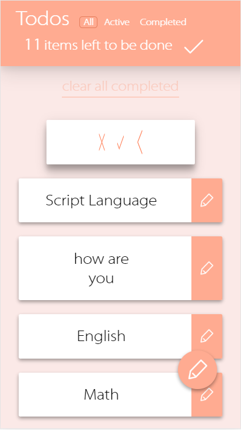
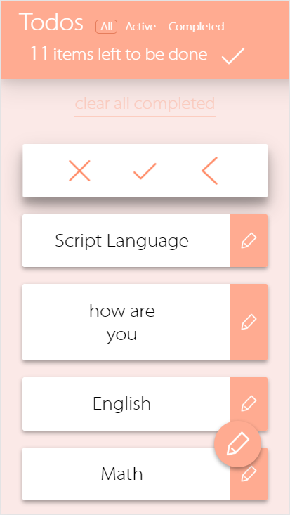
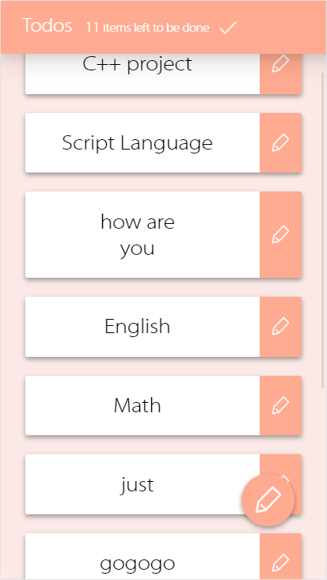
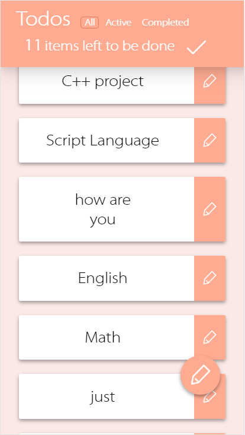
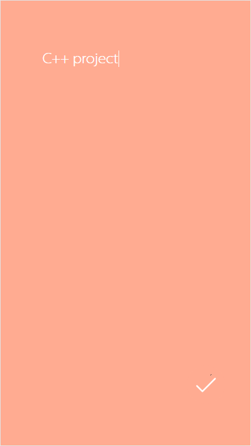

# TodoMVC Mobile with Material Design

> 1652772  Xiao Rui
>
> Script Language Programming - Course Project
>
> School of Software Engineering
>
> Shanghai Tongji University
>
> 2019 / 06 / 20

## Platform

The project is developed with chrome on PC in mobile device mode, and has past the test on Via browser on MEIZU 16th phone and Safari on iPhone 6s Plus.

## Introduction

The project is the final course project for the script language programming. It has realized the fundamental and some of the advanced requirements. And no frameworks or libraries are used.

The primary functions such as creating, removing, editing todo items and local storage are completely supported. You could play with your phone-based browser. There're some advanced requirements that are implemented. They'are shown as following.

## Highlights

### UI Style - Material Design

I've tried to construct the elements with material design style. 

### Transition Animations

All the animations are made using css and js code. You could refer to the todoMVC.css and todoMVC.js.

#### Write Button&Layer

The write new item button bubble would quickly become large and show the write layer. I've used the bezier curve to describe the acceleration.

#### Edit Side of Cards - Rotation

Click the text content of the card and it would rotate to show the buttons.

#### Slide Down to Fold Navigation Bar

When sliding down, the navigation bar would be folded.

And slide up to unfold it.

### Edit Single Item

Click the edit button ( seem like a pencil ) at the right side of the card and enter the edit page of the todo item.

